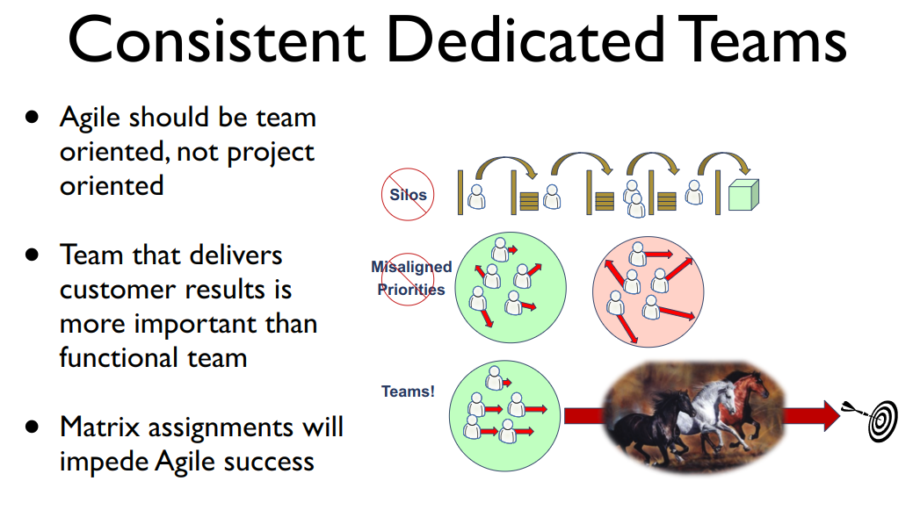

# Agile Development Practices

---

> “Developers make critical decisions about every 15 minutes”
>
> —Mary Poppendieck

---

## Design the Team
### Question Assumptions ASAP


### How many ways to define…
- number of teams
- team membership
- team scope
- team structure
- handoffs
- level of ceremony


### Patterns / Antipatterns
- [Big Ball of Mud](http://wiki.c2.com/?BigBallOfMud)
- [Blowhard Jamboree](http://wiki.c2.com/?BlowhardJamboree)
- [Cargo Cult](http://wiki.c2.com/?CargoCult)
- [Continuous Obsolescence](http://wiki.c2.com/?ContinuousObsolescence)
- [Golden Hammer](http://wiki.c2.com/?GoldenHammer)





> See [Andy Painter, Agile Pitfalls](https://nofluffjuststuff.com/conference/reston/2014/11/session?id=32677)


### Design the process
- Deliver early
- Decide late
- Learn continuously


### Design the process
- Deliver early
- Decide late
- Learn continuously

> See also Lean Software Development

---

## Evolutionary Architecture


> “We are searching for some kind of harmony between two intangibles: a form which we have not yet designed and a context which we cannot properly describe.”
>
> —Christopher Alexander


### Agile


### <span style="color:gray">Agile</span>
### <span style="color:gray">▼</span>
### No Upfront Design


### <span style="color:gray">Agile</span>
### <span style="color:gray">▼</span>
### <span style="color:gray">No Upfront Design</span>
### <span style="color:gray">▼</span>
### No Design


## What is our domain?
### Where do we fit into it?


### Stereotyping
- app
- service
- job
- library


### Stereotyping
- UI _(app)_
- API _(service, library)_
- No I _(job, script)_


### Nouns
- User
- Product
- Order
- Payment
- Invoice


### Verbs
- GET
- PUT
- PATCH
- POST
- DELETE

---

## Microservices


> “These days, you can't swing a dry erase marker without hitting someone talking about microservices.”
>
> —Nathaniel Schutta


### Six factors
1. **Multiple Rates of Change**


### Six factors
1. Multiple Rates of Change
2. **Independent Life Cycles**


### Six factors
1. Multiple Rates of Change
2. Independent Life Cycles
3. **Independent Scalability**


### Six factors
1. Multiple Rates of Change
2. Independent Life Cycles
3. Independent Scalability
4. **Isolated Failure**


### Six factors
1. Multiple Rates of Change
2. Independent Life Cycles
3. Independent Scalability
4. Isolated Failure
5. **Simplify Interactions with External Dependencies**
 - **a.k.a. the Façade Pattern**


### Six factors
1. Multiple Rates of Change
2. Independent Life Cycles
3. Independent Scalability
4. Isolated Failure
5. Simplify Interactions with External Dependencies
 - a.k.a. the Façade Pattern
6. **The Freedom to Choose the Right Tech for the Job**


### Six factors
1. Multiple Rates of Change
2. Independent Life Cycles
3. Independent Scalability
4. Isolated Failure
5. Simplify Interactions with External Dependencies
 - a.k.a. the Façade Pattern
6. The Freedom to Choose the Right Tech for the Job

> See [_"Should that be a Microservice?"_](https://content.pivotal.io/blog/should-that-be-a-microservice-keep-these-six-factors-in-mind)

---

## Refactoring


## Smells
- Alternative Classes with Different Interfaces
- Combinatorial Explosion
- Comments
- Conditional Complexity
- Data Class

---

## Technical Debt


## Technical Debt
### It's a metaphor.


> “It is not enough for code to work.”
>
> —Robert C. Martin


## Sustainability


## Sustainability
- Is it at least as maintainable now as it was before the iteration?


## Sustainability
- Could a new dev understand the new system at least as well and at least as quickly as the old one?


## Sustainability
- Can we deliver at least as much in the next iteration as we did this iteration?

---

## Automation


## Automation
- **If you do something manually, you'll know how to automate it**


## Automation
- If you do something manually, you'll know how to automate it
- **If you don't do something manually, you don't need to automate it**


### Source code is the earliest opportunity to automate


### Example
- Dev proposes revision → deploy to lowest environment
- …
- Team accepts revision → deploy to highest environment


---

## Environments


## Environments
- **Isolate variables**


## Environments
- Isolate variables
 - **Don't make everything different**


## Environments
- Isolate variables
 - Don't make everything different
- **Spread out risk**


## Environments
- Isolate variables
 - Don't make everything different
- Spread out risk
 - **Two or more production environments**


## Environments
- Isolate variables
 - Don't make everything different
- Spread out risk
 - Two or more production environments
- **Different feedback for different stakeholders**


## Environments
- Isolate variables
 - Don't make everything different
- Spread out risk
 - Two or more production environments
- Different feedback for different stakeholders
 - **Load testing and usability testing are very different kinds of QA**


---

## Automated Testing


### <span style="color:red;">Red</span>
### ▼
### <span style="color:green;">Green</span>
### ▼
### Refactor


## Behavior Driven Development


### Domain-specific language
### ▼
### Implementation language


```gherkin
Feature: Course Enrollment

  As a student
  I want to enroll in courses
  So that I can show up and learn things

  Scenario: Student enrolls in a course

    Given a student with active status and no holds
      And a course with no prerequisites
    When the student enrolls in the course
    Then the course roster includes the student
      And the available seats are reduced by one
```


```javascript
const mappings = {
  "/a student with active status and no holds/": () => {
    return this.student || (this.student = this.dao.create({
      id: 'ac582bc4-d1f5-45a9',
      holds: null,
      status: 'ACTIVE'
    }));
  },
  "/(a|the) student/": () => {
    return this.studentDao.retrieve('ac582bc4-d1f5-45a9');
  },
  "/(.+) enrolls in (.+)/": (student, course) => {
    course.add(student);
  }
}
```


|                 | <span style="color:cyan">TDD              </span>| <span style="color:violet">BDD</span>
| --------------- | ------------------------------------------------ | -------------------------------
| _written by_    | <span style="color:cyan">single developer </span>| <span style="color:violet">whole team</span>
| _scope_         | <span style="color:cyan">unit             </span>| <span style="color:violet">system</span>
| _surrogate for_ | <span style="color:cyan">developer        </span>| <span style="color:violet">end user</span>
| _preserves_     | <span style="color:cyan">API contract     </span>| <span style="color:violet">user outcome</span>
| _allows change_ | <span style="color:cyan">implementation   </span>| <span style="color:violet">user interface</span>

---

[paulerickson.github.io/agile-development-practices-talk](https://paulerickson.github.io/agile-development-practices-talk/)


# Thanks!

